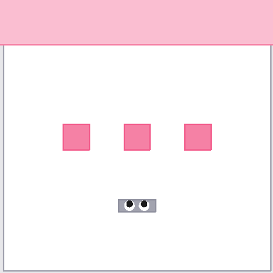
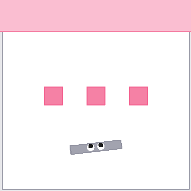
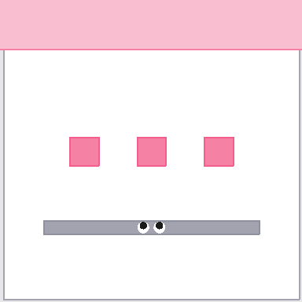

# x-magical


**x-magical** is a benchmark extension of [MAGICAL](https://github.com/qxcv/magical) specifically geared towards **cross-embodiment imitation**. The tasks still provide the Demo/Test structure that allows one to evaluate how well imitation or reward learning techniques can generalize the demonstrator's intent to substantially different deployment settings, but there's an added axis of variation focusing on how well these techniques can adapt to systematic embodiment gaps between the demonstrator and the learner. This is a challenging problem, as different embodiments are likely to use unique and suitable strategies that allow them to make progress on a task.

Embodiments in an *x-magical* task must still learn the same set of general skills like 2D perception and manipulation, but they are specifically designed such that they solve the task in different ways due to differences in their end-effector, shapes, dynamics, etc. For example, in the sweeping task, some agents can sweep all debris in one motion while others need to sweep them one at a time. These differences in execution speeds and state-action trajectories pose challenges for current LfD techniques, and the ability to generalize across embodiments is precisely what this benchmark evaluates.

*x-magical* is under active development - stay tuned for more tasks and embodiments!

## Tasks, Embodiments and Variants

Each task in *x-magical* can be instantiated with a particular **embodiment**, which changes the nature of the robotic agent. Additionally, the task can be instantiated in a particular **variant**, which changes one or more semantic aspects the environment. Both axes of variation are meant to evaluate combinatorial generalization. We list the task-embodiment pairings below, with a picture of the initial state of the *Demo* variant:

|                             Task                             | Description                                                  |
| :----------------------------------------------------------: | :----------------------------------------------------------- |
|  | **SweepToTop**: The agent must sweep all three debris to the goal zone shaded in pink. **Embodiments**: `Gripper`, `Shortstick`, `MediumStick`, `Longstick`. **Variants**: all except *Jitter*. |

Here is a description ([source](https://github.com/qxcv/magical#tasks-and-variants)) of what each variant modifies:

|  Variant   | Description                                                  |
| :--------: | :----------------------------------------------------------- |
|   *Demo*   | The default variant with no randomization, *i.e.* the same initial state across `reset()`. |
|  *Jitter*  | The rotations and orientations of all objects, and the size of goal regions, are jittered by up to 5% of the maximum range. |
|  *Layout*  | Positions and rotations of all objects are completely randomized. The definition of what constitutes an "object" is task-dependent, *i.e.* some tasks might not randomize the pose of the robotic agent, just the pushable shapes. |
|  *Color*   | The color of blocks and goal regions is randomized, subject to task-specific constraints. |
|  *Shape*   | The shape of pushable blocks is randomized, again subject to task-specific constraints. |
| *Dynamics* | The mass and friction of objects are randomized.             |
|   *All*    | All applicable randomizations are applied.                   |

## Usage

*x-magical* environments are available in the Gym registry and can be constructed via string specifiers that take on the form `<task>-<embodiment>-<observation_space>-<view_mode>-<variant>-v0`, where:

* **task**: The name of the desired task. See above for the full list of available tasks.
* **embodiment**: The embodiment to use for the robotic agent. See above for the list of supported embodiments per task.
* **observation_space**: Whether to use pixel or state-based observations. All environments support pixel observations but they may not necessarily provide state-based observation spaces.
* **view_mode**: Whether to use an allocentric or egocentric agent view.
* **variant**: The variant of the task to use. See above for the full list of variants.

For example, here's a short code snippet that illustrates this usage:

```python
import gym
import xmagical

# This must be called before making any Gym envs.
xmagical.register_envs()

# List all available environments.
print(xmagical.ALL_REGISTERED_ENVS)

# Create a demo variant for the SweepToTop task with a gripper agent.
env = gym.make('SweepToTop-Gripper-Pixels-Allo-Demo-v0')
obs = env.reset()
print(obs.shape)  # (384, 384, 3)
env.render(mode='human')
env.close()

# Now create a test variant of this task with a shortstick agent,
# an egocentric view and a state-based observation space.
env = gym.make('SweepToTop-Shortstick-State-Ego-TestLayout-v0')
init_obs = env.reset()
print(init_obs.shape)  # (16,)
env.close()
```

## Installation

**x-magical** requires Python 3.8 or higher. We recommend using an [Anaconda](https://docs.anaconda.com/anaconda/install/) environment for installation. You can create one with the following:

```bash
conda create -n xmagical python=3.8
conda activate xmagical
```

### Installing PyPI release

```bash
pip install x-magical
```

### Installing from source

Clone the repository and install in editable mode:

```bash
git clone https://github.com/kevinzakka/x-magical.git
cd x-magical
pip install -r requirements.txt
pip install -e .
```

### Contributing

If you'd like to contribute to this project, you should install the extra development dependencies as follows:

```bash
pip install -e .[dev]
```

## Acknowledgments

A big thank you to Sam Toyer, the developer of [MAGICAL](https://github.com/qxcv/magical), for the valuable help and discussions he provided during the development of this benchmark. Please consider citing MAGICAL if you find this repository useful:

```latex
@inproceedings{toyer2020magical,
  author    = {Sam Toyer and Rohin Shah and Andrew Critch and Stuart Russell},
  title     = {The {MAGICAL} Benchmark for Robust Imitation},
  booktitle = {Advances in Neural Information Processing Systems},
  year      = {2020}
}
```

Additionally, we'd like to thank Brent Yi for fruitful technical discussions and various debugging sessions.